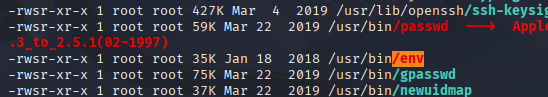
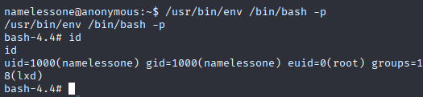

# nmap

Let's start out with a scan from nmap to see what ports are open on the target.

Okay, so we have ftp and smb open. Along with the name of the room being anonymous this seems interesting. And to make it easier for us, we'll add the IP to our hosts file.
$ echo "10.10.179.27 anon.thm" | sudo tee -a /etc/hosts

# ftp

We saw in the nmap scan that anonymous login was allowed. So I guess we just have to check out what we can find there.

Okay, so we find a directory with 777 permissions, that contains 3 files. A script, a log and a txt file. Let's download them and see what we can find out from them.

I certainly disagree. Keep it open for me...

Hmmm. This looks interesting! Seems to be a script that is supposed to clear the tmp folder. That certainly seems like something you'd schedule as a cron job, especially when we see that it has been run so many times without seemingly anything to remove. Although it will never remove anything. But that's beside the point.

# abusing cron jobs

So if it is scheduled as a cron job. How can we exploit that? The permissions on the directory on the server was really lax. So let's try to see if we can modify the script and then upload our version.

Now we'll set up a listener to receive the reverse shell.

$ nc -lnvp 1337

Nice! We got a shell working. 

And here in the users home directory we find the user.txt file.

Let's upgrade our shell to a tty

$ python -c 'import pty; pty.spawn("/bin/bash")'

Okay, so we have some pretty interesting groups. Trying sudo -l didn't give us anything though as it prompted us for a password and we don't have it.

# linpeas

At this point instead of doing it all manually I figured, might as well upload linpeas and run it.

We'll start by setting up a simple python HTTP server in our Downloads directory where we have linpeas.sh.

Now let's download it on our victim.

And it froze like this. Ah well, the cron job will keep executing the script anyways so it's not a big deal.
Now that we have a new shell going let's run linpeas.

Ah, right. The wget session is still going and hasn't released the file yet. Let's just kill it. And then execute it.

That looks interesting! env has the SUID bit set. Let's look at gtfobins and see if we can exploit that.
https://gtfobins.github.io/gtfobins/env/#suid

And we have root! Now we can just read /root/root.txt to get our root flag as well.

# conclusion

It was a pretty fun straight forward room. I'd definitely recommend it to others since it's mostly just logical thinking that will lead you to success.
